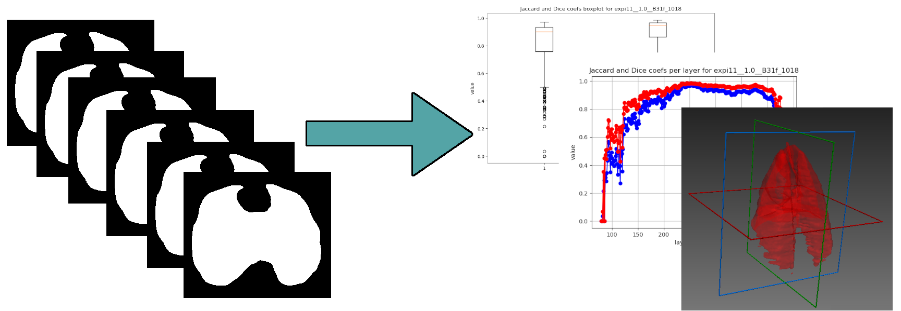

# Lungs image segmentation U-net
Postprocessing part of the solution, it converts set of 8bit png binary masks into raw file. Additionally it calculates Jaccard and Dice coefficients and draws lineplots and boxplots.

Line plots are representing Jaccard and Dice coefs values on individual layers in various positions on the CT image.

Box plots are representing distribution of the values for each CT image and for all.

To produce a valid input for this project you can follow instructions from [lungs-img-segmentation-unet](https://github.com/Stadzior/lungs-img-segmentation-unet) repo. 
The following project was tested on Python 3.6.8 64bit on Windows 10.

## Quickstart:
1. Prepare input files and move:
    - original binary masks to `.\data\analisys\mask`
    - segmentation results to `.\data\result`
2. You can customize your run in [main.py](main.py) (e.g. turn of raw file generation and draw plots only).
3. Run [main.py](main.py).
4. The progress should be visible on output window and under http://localhost:6006/.
5. After the process termination you can find:
    - box and line plots in `.\data\analisys\plots`
    - generated raw file in `.\data\generation`
    - process logs as .txt file    

## DISCLAIMER
Solution created as a part of my master degree thesis. If you want to use any part of those three solutions please add a reference to the following: 
<i>Kamil Stadryniak, "Segmentation of limited opacity CT lung images with the use of convolutional neural networks", Lodz University of Technology, 2019</i> 

Another parts of the solution can be found here: 
[lungs-img-segmentation-preprocessing](https://github.com/Stadzior/lungs-img-segmentation-preprocessing) 
[lungs-img-segmentation-unet](https://github.com/Stadzior/lungs-img-segmentation-unet)

Examples included in `.\data` are a small part of larger dataset gathered by Centre de Recherche en Neurosciences de Lyon in cooperation with Université Claude Bernard Lyon 1, INSA, Centre de Recherche en Acquisition et Traitement de l'Image pour la Santé.

I've got the permission to publish just enough of them to make a working example thus they cannot be used in any kind of research or commercial solution without proper permission.